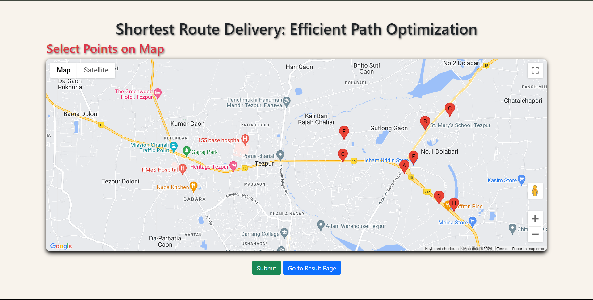
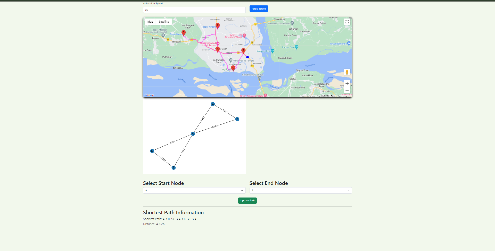

# Shortest-Route-Delivery-Efficient-Path-Optimization

# Shortest-Route-Delivery-Efficient-Path-Optimization
Finding the Shortest Path using Breadth-First Search (BFS)

##Selecting pointers


##Result Page


# Flask Application for Distance Calculation and Shortest Path Visualization

This Flask application calculates distances between points using the Google Maps API, visualizes these points and their connections as a graph, and finds the shortest path using Breadth-First Search (BFS).

## Features

1. **Save Points and Calculate Distances**: Accepts a set of geographical points, calculates distances between them using the Google Maps API, and saves these distances in a JSON file.
2. **Graph Visualization**: Visualizes the points and their connections as a graph using NetworkX and Matplotlib.
3. **Shortest Path Calculation**: Uses BFS to find the shortest path between two points in the graph.
4. **Route Information**: Retrieves route information from Google Maps API and displays it.

## Step-by-Step Implementation

### 1. Flask Setup and Routes

- **Flask App Initialization**: Creates a Flask application instance.
- **Home Route (`/`)**: Renders the main page (`index.html`).

### 2. Save Points and Calculate Distances

- **`/save_points` Route**:
  - Accepts a JSON object with geographical points.
  - Saves the points to `points.json`.
  - Calculates distances between points using the Google Maps API.
  - Saves these distances to `distances.json`.

### 3. Calculate Distances Function

- **`calculate_distances(data)`**:
  - Iterates through each pair of points.
  - Uses Google Maps API to calculate the driving distance between points.
  - Returns a dictionary with distances.

### 4. Graph Visualization

- **`draw_graph(graph)`**:
  - Uses NetworkX to create a graph from the distance data.
  - Visualizes the graph using Matplotlib.
  - Saves the graph image to the static directory.

### 5. Result Page

- **`/result` Route**:
  - Loads the points and distances from JSON files.
  - Draws the graph and returns the graph image path.
  - Renders the `result.html` template with nodes and graph image.

### 6. Update Path and Shortest Path Calculation

- **`/update_path` Route**:
  - Loads the graph from `distances.json`.
  - Accepts a JSON object with start and end nodes.
  - Uses BFS to find the shortest path.
  - Calculates the total distance of the shortest path.
  - Returns the shortest path and distance as JSON.

### 7. Breadth-First Search (BFS) Implementation

- **`bfs(graph, start, end)`**:
  - Implements BFS to find the shortest path in the graph.
  - Returns the path from start to end node.

### 8. Route Information from Google Maps

- **`/route` Route**:
  - Accepts a JSON object with start and end points.
  - Retrieves route information from the Google Maps API.
  - Returns the route polyline or an error if the route is not found.

## Running the Application

Run the Flask application using:

```bash
python app.py


